Gesture Recognition for Human-Robot Interaction: An approach based on skeletal points tracking using depth camera
===============================================

Human-robot interaction (HRI) has been a topic of both science fiction and academic speculation even before any robots existed. HRI research is focusing to build an intuitive and easy communication with the robot through speech, gestures and facial expressions. The use of hand gestures provides a better solution than conventional human-machine interfaces. Furthermore, translations of hand gestures can help in accomplishing the ease and naturalness desired for HRI. This has motivated a very active research concerned with computer vision-based analysis and interpretation of hand gestures.

In this project, we aim to implement the hand gesture recognition for robots with modeling, training, classifying and recognizing gestures based on computer vision algorithms and machine learning techniques. Gestures are modeled based on skeletal points and the features are extracted using NiTE framework using a depth camera. 

In order to recognize gestures, we propose to learn and classify hand gestures with the help of Adaptive Naive Bayes Classifier using Gesture Recognition Toolkit. Furthermore, we aim to build a dashboard that can visualize the interaction between all essential parts of the system. Finally, we attempt to integrate all these functionalities into a system that interacts with a humanoid robot NAO.

As a result, on one hand, gestures will be used command the robot to execute certain actions and on the other hand, gestures will be translated and spoken out by the robot. 

[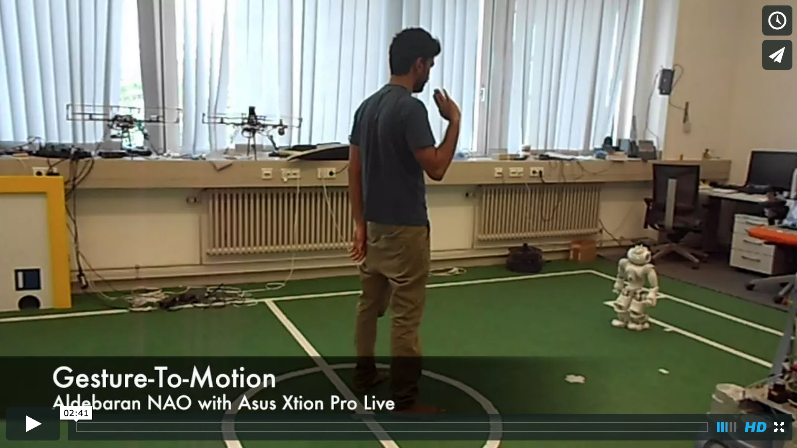](https://vimeo.com/133496854 "Click to Watch!")

AUTHOR
--------------------------------------
Aravinth Panchadcharam < http://www.aravinth.info >

ACKNOWLEDGEMENTS
--------------------------------------
- Dr. Yuan Xu : DAInamite Robocup Team, Distributed Artificial Intelligence Laboratory, Berlin
- Prof. Dr.-Ing. habil. Dr. h.c. Sahin Albayrak :  Technical University of Berlin 

DESIGN
--------------------------------------

Our goal in this project to implement a system that should be integrated into NAO to recognize hand gestures. Existing stereo cameras of NAO are greatly limited by the quality of the input image. Variations in lighting and background clutters would only worsen the problem. On the other hand, depth-based approaches are able to provide satisfactory results for hand gesture recognition even with poor indoor lighting and cluttered background condition. Therefore, we have chosen Asus Xtion which has sensors that capture both RGB and depth data. Asus Xtion is an OpenNI compatible device, thus, we have chosen a NiTE middleware for the purpose of tracking the human skeletal points. 

We have chosen Gesture Recognition Toolkit (GRT) to train and predict the 3D skeletal modeled gestures with feature based statistical learning algorithm. Adaptive Naive Bayes Classifier (ANBC) is the supervised machine learning algorithm which is chosen for the purpose of classifying and predicting the hand gestures in real time.

Furthermore, all these interactions must be displayed to visually understand the status of the system. Finally, recognized hand gestures must be translated to robotic actions as following :

- **Gesture-to-Speech**: This action should translate the recognized gestures and it should be spoken out loud using the integrated loudspeaker.
    
- **Gesture-to-Motion**: This action should move the robot from one position to another in the 2 dimensional space. Therefore, each gesture should be assigned to a locomotion task.
    
- **Gesture-to-Gesture**: This action should translate the human hand gesture to a robotic hand gesture by imitating hand gestures of the user. 

The goal should be reached by studying the various solution to this problem and an appropriate design must be chosen. The main challenge is to find a solution that can integrate all these components into a robust system.

Furthermore, this system must be tested and results must be presented clearly. Evaluations must be carried out to demonstrate the effectiveness of the classifier and to validate its potential for real time gesture recognition

BACKGROUND
--------------------------------------
### Aldebaran NAO - Humanoid Robot
- Humanoid Robot from Aldebaran Robotics
- 25 Degrees of Freedom
- Intel Atom @ 1.6 GHz
- 1GB RAM
- 32-bit Gentoo Linux 
- Real-time OS patched
- NAOqi SDK in C++, Python

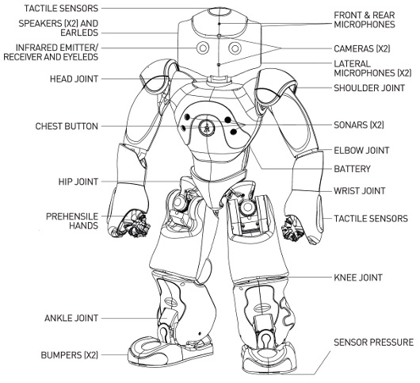

### Asus Xtion PRO LIVE - Depth Camera
- Infrared depth camera
- 30 frames per second
- RGB video
- VGA (640x480): 30 fps
- QVGA (320x240): 60 fps
- OpenNI compatible
- Light weight
- USB powered

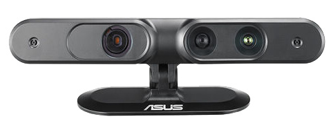

### OpenNI 2 and NiTE 2 - Skeleton Tracking Algorithm
- OpenNI 2 - Open Natural Interaction
    - Primesense driver for depth camera
- NiTE 2 - Natural Interaction Technology for End-user
    - OpenNI middleware
    - Human skeleton tracking
    - Hand tracking
    - Gestures detection
    - C++ Library

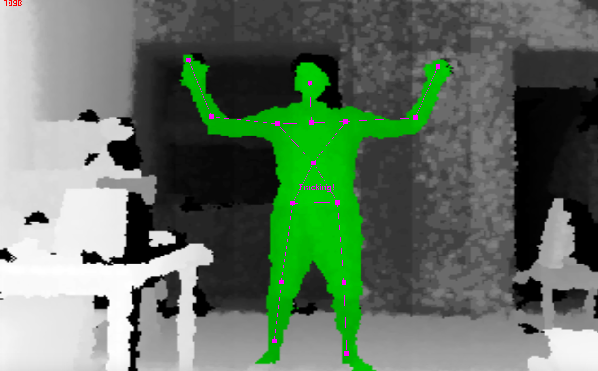

### Gesture Recognition Toolkit (GRT)
- Open source C++ library from MIT Media Lab
- Machine Learning toolkit for real time gesture recognition
- Classification and regression algorithms for static and temporal gestures
- Flexible Object Oriented Gesture recognition pipeline with preprocessing, feature extraction, classification, post-processing modules
- Classification Algorithms ANBC, SVM, MinDist, HMM, KNN, DTW

### Adaptive Naive Bayes Classifier (ANBC) - Classification Algorithm
- Based on Bayes Theory
- N-dimensional input classification for basic and complex static gestures recognition
- Gaussian distribution on input stream for real time prediction
- Null rejection region threshold for non-gestures
- Faster learning and prediction algorithm
- Online training

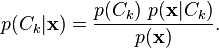

IMPLEMENTATION
--------------------------------------
### Gesture Modelling
- Gestures based on skeletal points of left and right hand
- Five static gestures modelled based on traffic police hand signals - Walk, Turn Right, Turn Left, Move Right, Move Left

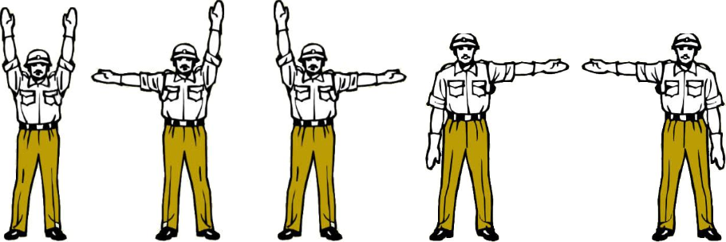

### NAO Depth Camera Mount
- 3D printed head mount for NAO to hold Asus Xtion
 

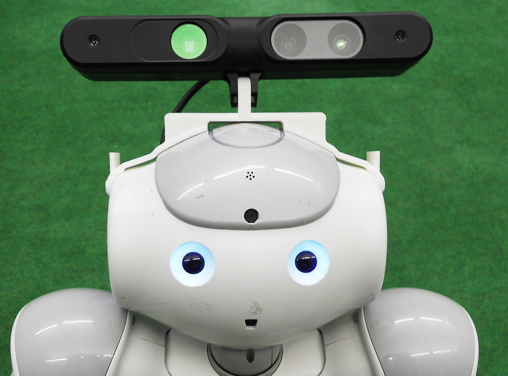
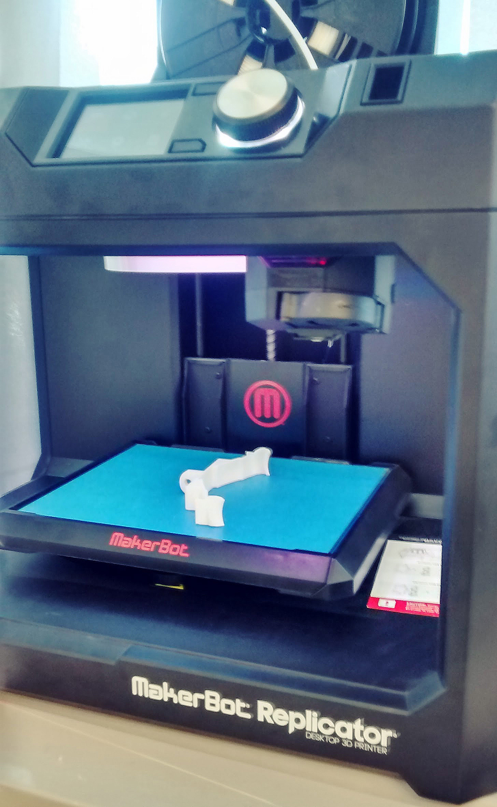

### HRI Module
- Accesses the depth camera via OpenNI 2
- Starts skeleton / hand tracking using NiTE 2
- Starts UDP Server to stream tracked joints to Brain module
- Starts skeleton tracking using “Hands Raise” pose and hand tracking using “WAVE” focus gesture
- When hand reaches the edge of field of view or hand is lost, informs the Brain module
- Developed in C++ using Xcode on Mac OSX
- Built using Clang for Mac OSX and Cmake GCC for 32-bit and 64-bit Linux
- Uses Boost libraries such as Boost.Asio, Log, Thread

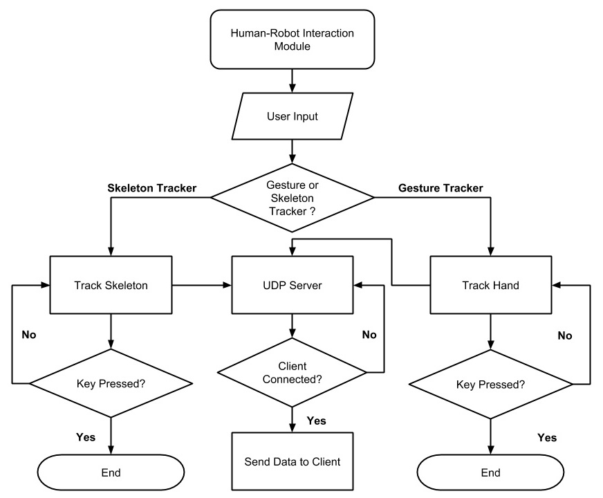

### Brain Module
- Starts UDP client to connect to HRI module
- Starts WebSocket server to broadcast the results to Control Center and Command modules
- Accepts 3 dimensional vector of hand
- In training mode, stores input samples into training dataset for each class
- In prediction mode, trains the classifier with the training data and performs real time prediction on the stream of input samples of left and right hand
- Post-processes the prediction results and triggers output, when the gesture is gesticulated for more than one second
- Developed in C++ using GRT, Boost, websocketpp

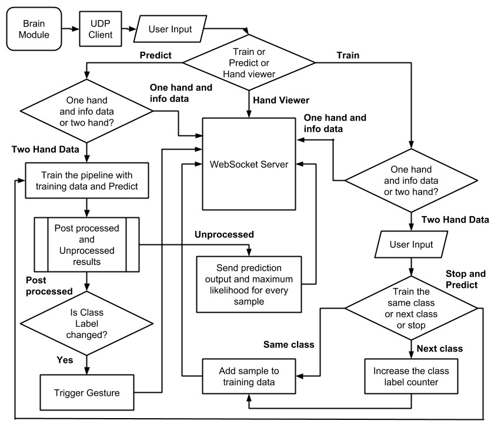

### CC Module
- Starts WebSocket client to connect to Brain module
- Acts as the eye of the project to visualize the internal interactions between modules
- Cross compatible app and needs just latest browser
- Renders skeletal joint positions in 3D
- Display prediction results and info messages
- Developed in Javascript using WebStorm IDE on Mac OSX
- Uses WebGL renderer
- Uses libraries such as ThreeJS, RequireJS, jQuery, underscore and native JS websocket
- Can replay from dumped data

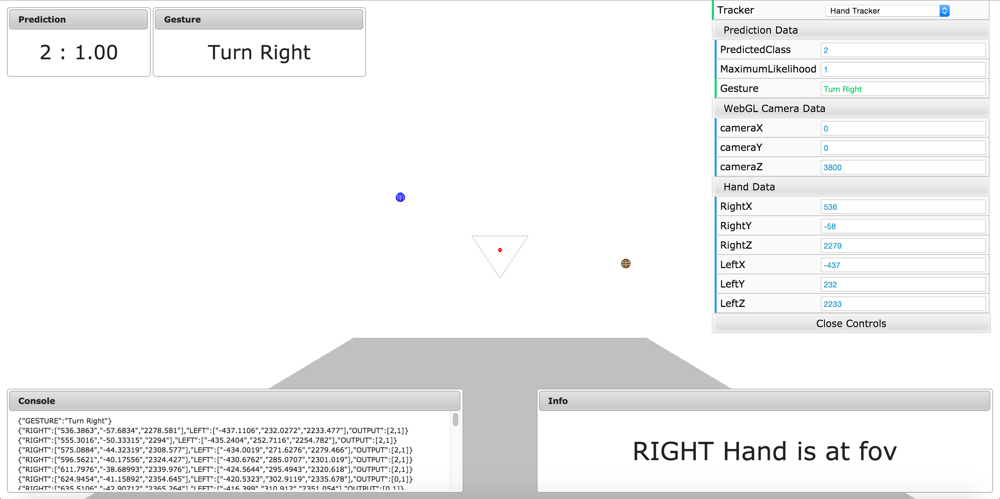

### Command Module
- Starts WebSocket client to connect to Brain module
- Uses NAOqi SDK to proxy ALMotion, ALRobotPosture, ALTextToSpeech
- Receives recognized gestures and info messages from Brain module
- Commands NAO to do text-to-speech, locomotion and joint control tasks
- Executes Gesture-to-Speech, Gesture-to-Motion and Gesture-to-Gesture translations
- Developed in Python using PyCharm on Mac OSX
- Completes the hand gesture recognition for Human-robot interaction

RESULTS
--------------------------------------

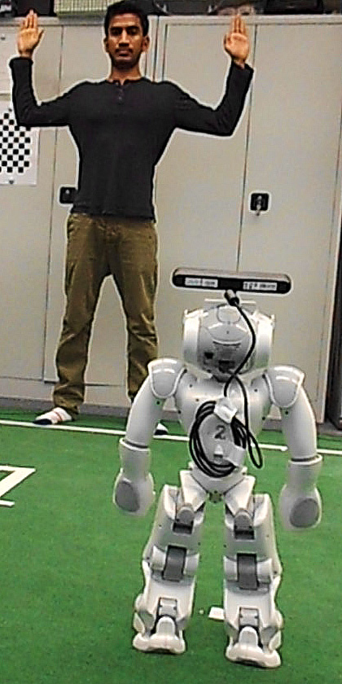
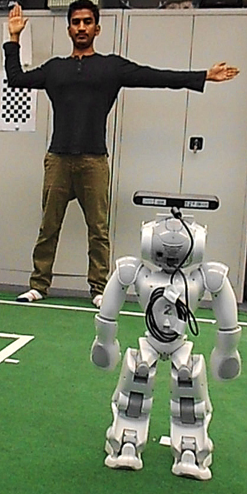
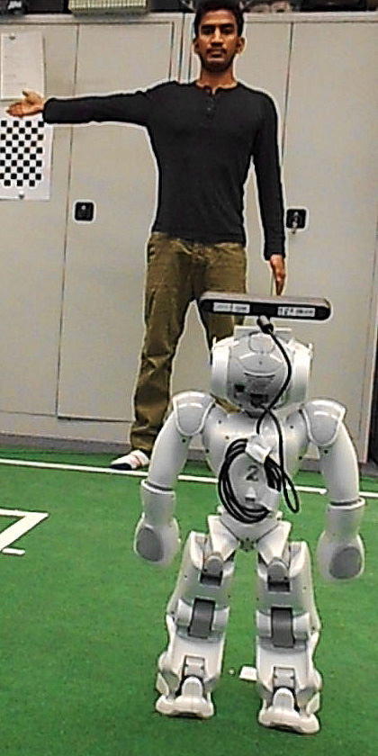

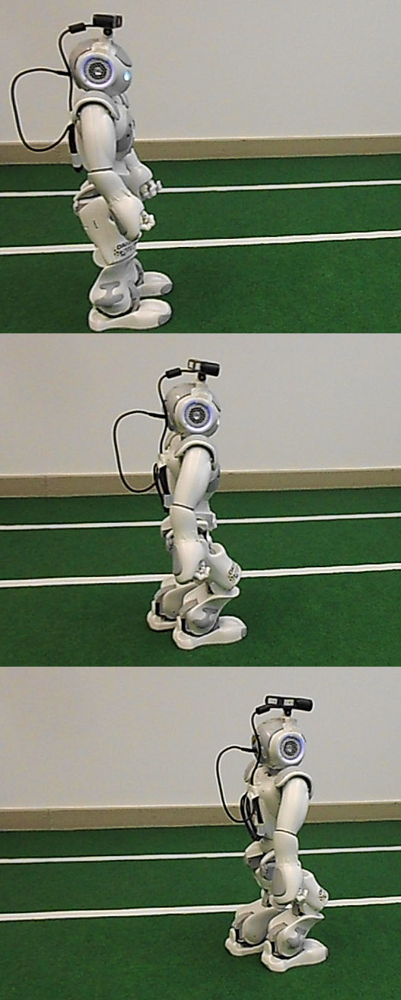
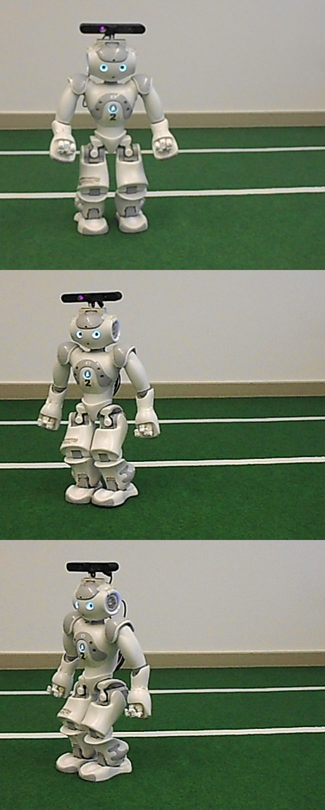
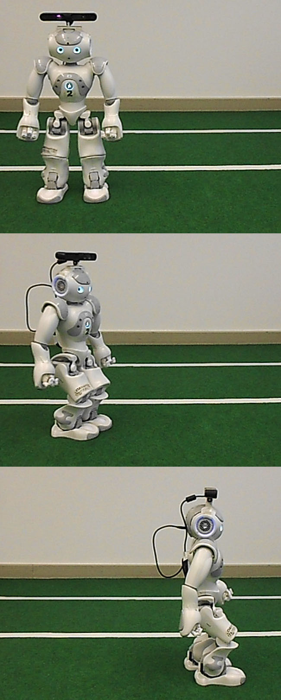

EVALUATION
--------------------------------------
### Confusion Matrix - Precision, Recall, F-Measure

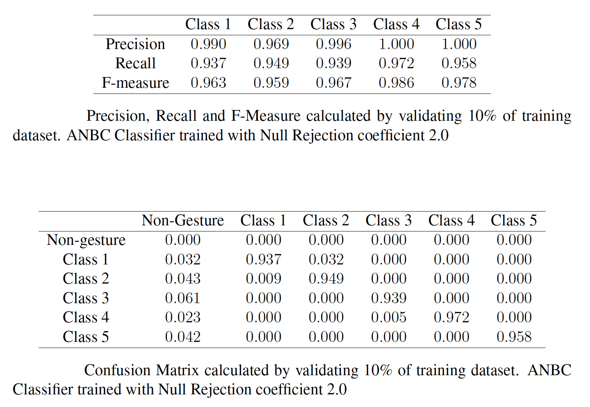

### Classification - Accuracy

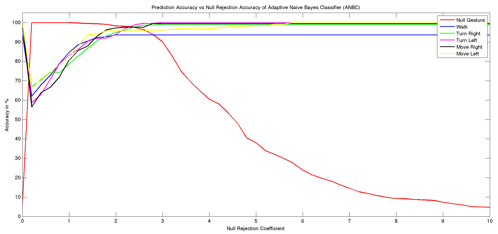

### Training Data - Mean Positions 

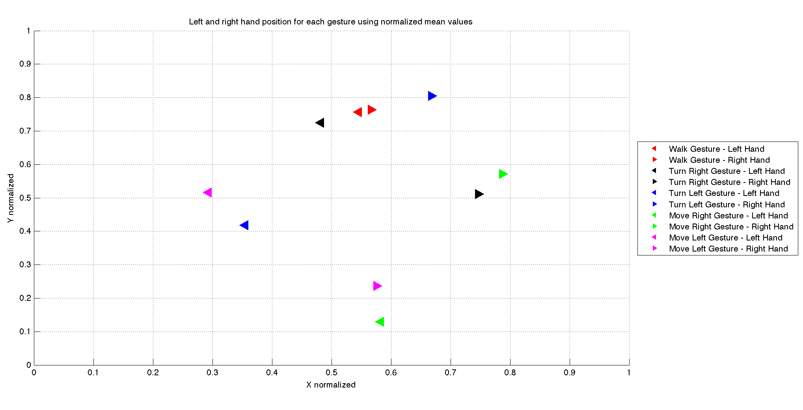

### Training Data - Min-Max Distance

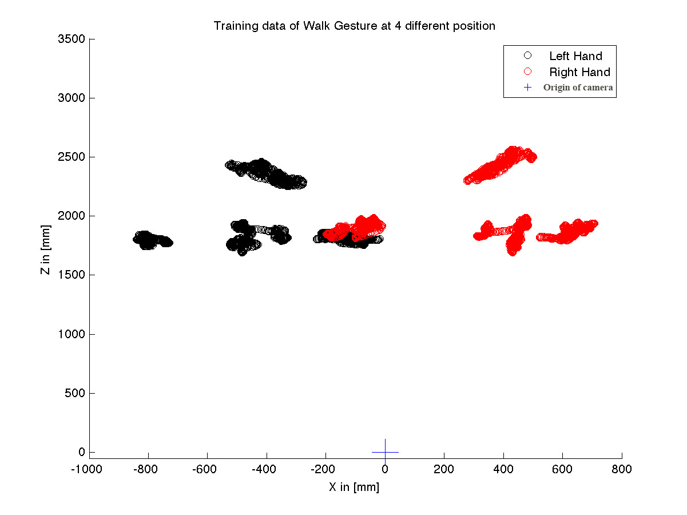

CONCLUSION & FUTURE WORK
--------------------------------------
- Results show that the implementation achieves the goal by building a robust system for NAO to facilitate human-robot interactions based on skeletal points tracking using depth camera.
- It can be further improved to recognize more static gestures by training more and dynamic gestures by extending it with classifiers such as Dynamic Time Warping or Hidden Markov Model which are readily available in GRT.

