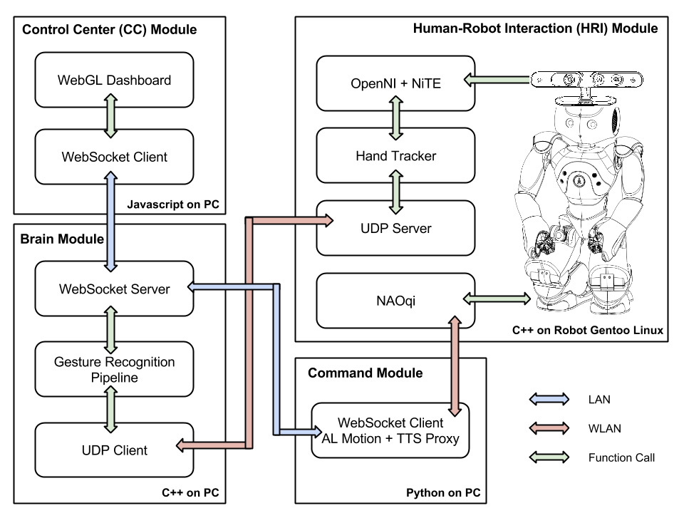

Gesture Recognition for Human-Robot Interaction: An approach based on skeletal
points tracking using depth camera
===============================================
Human-robot interaction (HRI) has been a topic of both science fiction and academic speculation even before any robots existed. HRI research is focusing to build an intuitive and easy communication with the robot through speech, gestures and facial expressions. The use of hand gestures provides a better solution than conventional human-machine interfaces. Furthermore, translations of hand gestures can help in accomplishing the ease and naturalness desired for HRI. This has motivated a very active research concerned with computer vision-based analysis and interpretation of hand gestures.

In this project, we aim to implement the hand gesture recognition for robots with modeling, training, classifying and recognizing gestures based on computer vision algorithms and machine learning techniques. Gestures are modeled based on skeletal points and the features are extracted using NiTE framework using a depth camera. 

In order to recognize gestures, we propose to learn and classify hand gestures with the help of Adaptive Naive Bayes Classifier using Gesture Recognition Toolkit. Furthermore, we aim to build a dashboard that can visualize the interaction between all essential parts of the system. Finally, we attempt to integrate all these functionalities into a system that interacts with a humanoid robot NAO.

As a result, on one hand, gestures will be used command the robot to execute certain actions and on the other hand, gestures will be translated and spoken out by the robot. 

AUTHOR
--------------------------------------
Aravinth Panchadcharam < http://www.aravinth.info >

Design
--------------------------------------

Our goal in this project to implement a system that should be integrated into NAO to recognize hand gestures. Existing stereo cameras of NAO are greatly limited by the quality of the input image. Variations in lighting and background clutters would only worsen the problem. On the other hand, depth-based approaches are able to provide satisfactory results for hand gesture recognition even with poor indoor lighting and cluttered background condition. Therefore, we have chosen Asus Xtion which has sensors that capture both RGB and depth data. Asus Xtion is an OpenNI compatible device, thus, we have chosen a NiTE middleware for the purpose of tracking the human skeletal points. 

We have chosen Gesture Recognition Toolkit (GRT) to train and predict the 3D skeletal modeled gestures with feature based statistical learning algorithm. Adaptive Naive Bayes Classifier (ANBC) is the supervised machine learning algorithm which is chosen for the purpose of classifying and predicting the hand gestures in real time.

Furthermore, all these interactions must be displayed to visually understand the status of the system. Finally, recognized hand gestures must be translated to robotic actions as following :

- Gesture-to-Speech: This action should translate the recognized gestures and it should be spoken out loud using the integrated loudspeaker.
    
- Gesture-to-Motion: This action should move the robot from one position to another in the 2 dimensional space. Therefore, each gesture should be assigned to a locomotion task.
    
- Gesture-to-Gesture: This action should translate the human hand gesture to a robotic hand gesture by imitating hand gestures of the user. 

The goal should be reached by studying the various solution to this problem and an appropriate design must be chosen. The main challenge is to find a solution that can integrate all these components into a robust system.

Furthermore, this system must be tested and results must be presented clearly. Evaluations must be carried out to demonstrate the effectiveness of the classifier and to validate its potential for real time gesture recognition

