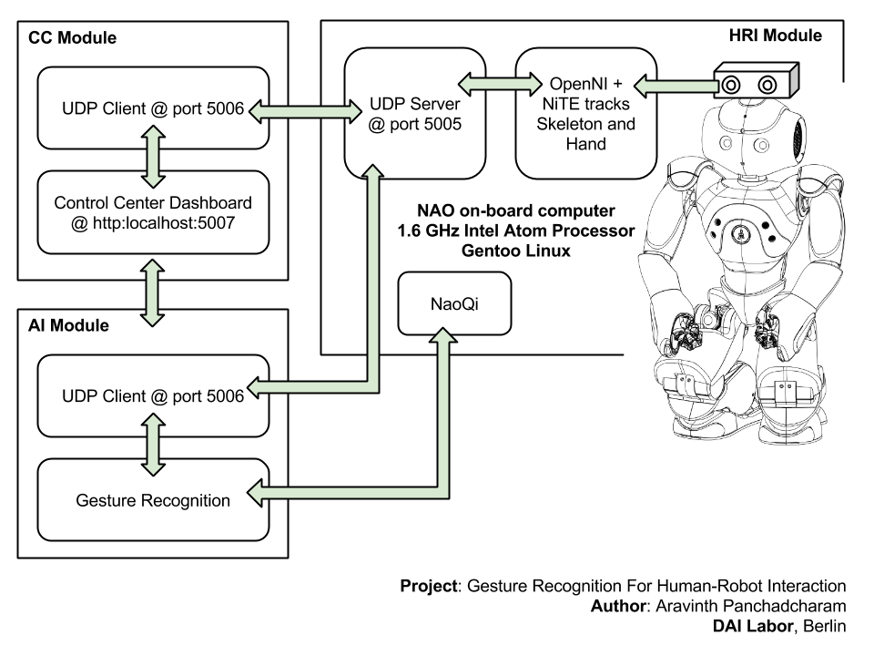

Modules
==================================================================

DESCRIPTION
--------------------------------------
Gesture Recognition For Human-Robot Interaction project has three modules.
Each module is implemented in different environment and they communicate with each using using UDP.
All these modules share a configuration file that contains configurations such as port number, hostname and log path.

- [Human-Robot-Interaction (HRI) module](human-robot-interaction/README.md)
- [Control Center (CC) module](control-center/README.md)
- [Brain (AI) module](brain/README.md)

